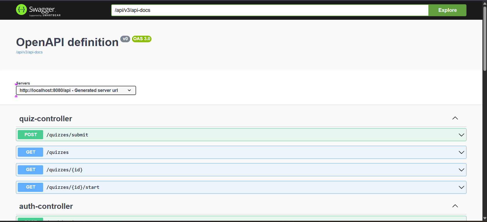

# Quiz Application Backend

A RESTful backend application for conducting online quizzes with user authentication, scoring, leaderboards, and analytics.

## 🎯 Project Overview

This application provides a complete backend solution for quiz management where users can:
- Register and authenticate using JWT tokens
- Take quizzes with random question selection
- Submit answers and receive instant scoring
- View leaderboards to see top performers
- Track their quiz attempt history

## 🏗️ Architecture & Design Decisions

### Layered Architecture
The application follows a clean **4-layer architecture** for separation of concerns:

```
┌─────────────────────────────────────┐
│     Controller Layer                │  ← REST endpoints, validation
├─────────────────────────────────────┤
│     Service Layer                   │  ← Business logic, transactions
├─────────────────────────────────────┤
│     Repository Layer                │  ← Data access (Spring Data JPA)
├─────────────────────────────────────┤
│     Domain Layer                    │  ← Entities, models
└─────────────────────────────────────┘
```

**Why this matters:**
- **Maintainability**: Changes in one layer don't cascade to others
- **Testability**: Each layer can be unit tested independently
- **Scalability**: Easy to add new features without breaking existing code

### Key Design Decisions

#### 1. **JWT-Based Stateless Authentication**
- **Decision**: Use JWT tokens instead of session-based authentication
- **Rationale**:
    - Enables horizontal scaling (no session storage needed)
    - Better for microservices architecture
    - Reduces database load
    - Mobile-friendly (tokens can be easily stored)

#### 2. **Random Question Selection**
- **Decision**: Fetch 10 random questions per quiz attempt using database-level randomization
- **Implementation**: Native SQL query with `ORDER BY RAND() LIMIT 10`
- **Rationale**:
    - Prevents cheating (different users get different question sets)
    - Increases quiz replayability
    - Balances question exposure across the question bank

#### 3. **Best Score Leaderboard Strategy**
- **Decision**: Show only the best attempt per user on leaderboards
- **Implementation**: Complex SQL query using GROUP BY with MAX aggregation
- **Rationale**:
    - Fair competition (users judged by their best performance)
    - Encourages retry without penalty
    - Prevents leaderboard spam from multiple attempts
    - **Alternative considered**: Average score (rejected as it penalizes learning)

#### 4. **Separate DTOs for API Contracts**
- **Decision**: Use dedicated DTO classes instead of exposing entities directly
- **Examples**:
    - `QuestionDto` excludes `correctAnswer` when starting a quiz
    - `AuthResponse` packages token with user info
- **Rationale**:
    - Security: Control exactly what data is exposed
    - Flexibility: API changes don't require entity changes
    - Validation: Request-specific constraints

#### 5. **Options Stored as JSON Strings**
- **Decision**: Store question options as JSON array strings in the database
- **Format**: `["Option1","Option2","Option3","Option4"]`
- **Rationale**:
    - Flexible: Easy to support varying numbers of options
    - Simple: No need for separate `Options` table
    - Performant: Single database read per question
    - **Trade-off**: Slightly harder to query individual options (acceptable for read-heavy workload)

#### 6. **Centralized Exception Handling**
- **Decision**: Global exception handler with custom exception types
- **Implementation**: `@RestControllerAdvice` with specific handlers
- **Rationale**:
    - Consistent error responses across all endpoints
    - Cleaner controller code (no try-catch blocks)
    - Better debugging with structured error messages

#### 7. **File-Based H2 Database**
- **Decision**: Use file-based H2 instead of in-memory
- **Rationale**:
    - Data persists across application restarts
    - Easier development and testing
    - Production-ready migration path (just swap H2 for PostgreSQL/MySQL)

## 🛠️ Technology Stack

- **Framework**: Spring Boot 3.x
- **Security**: Spring Security with JWT
- **Database**: H2 (development), easily switchable to PostgreSQL/MySQL
- **ORM**: Spring Data JPA with Hibernate
- **Build Tool**: Maven
- **Testing**: JUnit 5, Mockito
- **Java Version**: 17+

## 📦 Project Structure

```
src/main/java/com/github.com/Nayan-Mudewar
├── config/              # Security, JWT, and app configuration
│   ├── SecurityConfig.java
│   ├── JwtUtil.java
│   ├── JwtAuthenticationFilter.java
│   └── DataLoader.java
├── controller/          # REST API endpoints
│   ├── AuthController.java
│   ├── QuizController.java
│   ├── LeaderboardController.java
│   └── UserController.java
├── service/             # Business logic layer
│   ├── AuthService.java
│   ├── QuizService.java
│   ├── AttemptService.java
│   ├── LeaderboardService.java
│   └── CustomUserDetailsService.java
├── repository/          # Data access layer
│   ├── UserRepository.java
│   ├── QuizRepository.java
│   ├── QuestionRepository.java
│   └── AttemptRepository.java
├── domain/              # Entity models
│   ├── User.java
│   ├── Quiz.java
│   ├── Question.java
│   └── Attempt.java
├── dto/                 # Data Transfer Objects
│   ├── AuthResponse.java
│   ├── QuizStartResponse.java
│   ├── QuizSubmitRequest.java
│   └── ...
└── exception/           # Custom exceptions
    ├── GlobalExceptionHandler.java
    ├── ResourceNotFoundException.java
    └── BadRequestException.java
```

## 🚀 Getting Started

### Prerequisites
- Java 17 or higher
- Maven 3.6+
- Git

### Installation & Setup

1. **Clone the repository**
```bash
git clone <repository-url>
cd quiz-app
```

2. **Configure application properties**
```properties
# src/main/resources/application.properties
server.port=8080

# H2 Database (File-based)
spring.datasource.url=jdbc:h2:file:./data/quizdb
spring.datasource.username=sa
spring.datasource.password=

# JPA Configuration
spring.jpa.hibernate.ddl-auto=update
spring.jpa.show-sql=true

# H2 Console
spring.h2.console.enabled=true
spring.h2.console.path=/h2-console

# JWT Configuration
jwt.secret=your-secret-key-change-in-production
jwt.expiration=86400000
```

3. **Build the project**
```bash
mvn clean install
```

4. **Run the application**
```bash
mvn spring-boot:run
```

The application will start on `http://localhost:8080`

### Sample Data
On first startup, the application automatically loads:
- ✅ A test user: `test@example.com` / `password123`
- ✅ A sample quiz with 15 general knowledge questions

## 📚 API Documentation

### Swagger UI



Access interactive documentation at: http://localhost:8080/swagger-ui.html


### Base URL
```
http://localhost:8080/api
```

### Authentication Endpoints

#### Register
```http
POST /api/auth/register
Content-Type: application/json

{
  "name": "Nayan Mudewar",
  "email": "nayanmudewar2002@gmail.com",
  "password": "password123"
}

Response: 201 Created
{
  "token": "eyJhbGciOiJIUzI1NiIsInR5cCI6IkpXVCJ9...",
  "email": "nayanmudewar2002@gmail.com",
  "name": "Nayan Mudewar",
  "userId": 1
}
```

#### Login
```http
POST /api/auth/login
Content-Type: application/json

{
  "email": "nayanmudewar2002@gmail.com",
  "password": "password123"
}

Response: 200 OK
{
  "token": "eyJhbGciOiJIUzI1NiIsInR5cCI6IkpXVCJ9...",
  "email": "nayanmudewar2002@gmail.com",
  "name": "Nayan Mudewar",
  "userId": 1
}
```

### Quiz Endpoints (Requires Authentication)

**Note**: All quiz endpoints require `Authorization: Bearer <token>` header

#### Get All Quizzes
```http
GET /api/quizzes
Authorization: Bearer <token>

Response: 200 OK
[
  {
    "id": 1,
    "title": "General Knowledge Quiz",
    "category": "General"
  }
]
```

#### Start a Quiz
```http
GET /api/quizzes/{id}/start
Authorization: Bearer <token>

Response: 200 OK
{
  "quizId": 1,
  "title": "General Knowledge Quiz",
  "category": "General",
  "questions": [
    {
      "id": 3,
      "question": "What is 2 + 2?",
      "options": ["3", "4", "5", "6"]
    }
    // ... 9 more random questions (correctAnswer NOT included)
  ]
}
```

#### Submit Quiz
```http
POST /api/quizzes/submit
Authorization: Bearer <token>
Content-Type: application/json

{
  "quizId": 1,
  "answers": {
    "1": "Paris",
    "2": "Leonardo da Vinci",
    "3": "4",
    "4": "Mars",
    "5": "William Shakespeare",
    "6": "Pacific",
    "7": "7",
    "8": "2",
    "9": "Lion",
    "10": "H2O"
  }
}

Response: 200 OK
{
  "attemptId": 1,
  "quizId": 1,
  "quizTitle": "General Knowledge Quiz",
  "score": 10,
  "totalQuestions": 10,
  "percentage": 100.0,
  "completedAt": "2025-10-03T21:30:00",
  "results": [
    {
      "questionId": 1,
      "question": "What is the capital of France?",
      "userAnswer": "Paris",
      "correctAnswer": "Paris",
      "isCorrect": true
    }
    // ... results for all 10 questions
  ]
}
```

#### Get Leaderboard
```http
GET /api/quizzes/{id}/leaderboard?limit=10
Authorization: Bearer <token>

Response: 200 OK
{
  "quizId": 1,
  "quizTitle": "General Knowledge Quiz",
  "totalAttempts": 15,
  "leaderboard": [
    {
      "userId": 1,
      "userName": "Nayan Mudewar",
      "userEmail": "nayanmudewar2002@gmail.com",
      "score": 10,
      "percentage": 100.0,
      "completedAt": "2025-10-03T15:30:00",
      "rank": 1
    }
    // ... more entries (only best score per user)
  ]
}
```

### User Endpoints

#### Get User Attempt History
```http
GET /api/users/me/attempts
Authorization: Bearer <token>

Response: 200 OK
[
  {
    "attemptId": 3,
    "quizId": 1,
    "quizTitle": "General Knowledge Quiz",
    "quizCategory": "General",
    "score": 10,
    "totalQuestions": 10,
    "percentage": 100.0,
    "completedAt": "2025-10-03T21:30:00"
  }
  // ... all attempts by this user, most recent first
]
```

## 🧪 Running Tests

### Run All Tests
```bash
mvn test
```

### Run Specific Test Class
```bash
mvn test -Dtest=AuthServiceTest
```

### Test Coverage
The project includes unit tests for:
- ✅ Authentication Service (register, login, validation)
- ✅ Quiz Service (start quiz, question randomization)
- ✅ Attempt Service (submission, scoring, validation)
- ✅ Edge cases and error scenarios

### Example Test Execution
```bash
[INFO] -------------------------------------------------------
[INFO]  T E S T S
[INFO] -------------------------------------------------------
[INFO] Running com.yourpackage.service.AuthServiceTest
[INFO] Tests run: 4, Failures: 0, Errors: 0, Skipped: 0
[INFO] Running com.yourpackage.service.QuizServiceTest
[INFO] Tests run: 4, Failures: 0, Errors: 0, Skipped: 0
[INFO] Running com.yourpackage.service.AttemptServiceTest
[INFO] Tests run: 3, Failures: 0, Errors: 0, Skipped: 0
[INFO] 
[INFO] Results:
[INFO] 
[INFO] Tests run: 11, Failures: 0, Errors: 0, Skipped: 0
```

## 🔐 Security Features

1. **Password Encryption**: BCrypt hashing for all passwords
2. **JWT Token Validation**: Automatic token verification on protected endpoints
3. **Stateless Sessions**: No server-side session storage
4. **CORS Configuration**: Configurable for frontend integration
5. **SQL Injection Prevention**: Parameterized queries via JPA
6. **Input Validation**: Bean validation on all request DTOs

## 🗄️ Database Schema

### Entity Relationships
```
User (1) ──────────< (N) Attempt
                         │
Quiz (1) ──────────< (N) │
  │                       │
  └──────< (N) Question   │
                          │
                    (relates to)
```

### Key Tables

**users**
- `id` (Primary Key)
- `name`
- `email` (Unique)
- `password` (BCrypt hashed)

**quizzes**
- `id` (Primary Key)
- `title`
- `category`

**questions**
- `id` (Primary Key)
- `quiz_id` (Foreign Key → quizzes)
- `question` (Text)
- `options` (JSON string array)
- `correct_answer`

**attempts**
- `id` (Primary Key)
- `user_id` (Foreign Key → users)
- `quiz_id` (Foreign Key → quizzes)
- `score`
- `completed_at` (Timestamp)

## 📊 Key Assumptions & Constraints

1. **Quiz Length**: All quizzes return exactly 10 random questions
2. **Question Pool**: Each quiz must have at least 10 questions to be playable
3. **Multiple Attempts**: Users can take the same quiz multiple times
4. **Leaderboard**: Shows best score per user (not average or most recent)
5. **Answer Format**: Answers must exactly match one of the provided options
6. **Token Expiry**: JWT tokens expire after 24 hours
7. **Case Sensitivity**: Answer comparison is case-insensitive

## 🚧 Future Enhancements

- [ ] Quiz categories and filtering
- [ ] Timed quizzes with countdown
- [ ] Question difficulty levels
- [ ] User roles (Admin, User)
- [ ] Quiz creation API for admins
- [ ] Detailed analytics dashboard
- [ ] Email verification on registration
- [ ] Password reset functionality
- [ ] Pagination for large leaderboards
- [ ] Caching layer for frequently accessed data

## 🐛 Troubleshooting

### Common Issues

**Issue**: "User not found" error after restart
- **Cause**: Using in-memory H2 database
- **Solution**: Data is automatically reloaded via `DataLoader.java`. Default user credentials are in console logs.

**Issue**: JWT token validation fails
- **Cause**: Token expired or invalid secret key
- **Solution**: Check `jwt.secret` in properties and ensure it's consistent across restarts

**Issue**: "403 Forbidden" on auth endpoints
- **Cause**: Security configuration issue
- **Solution**: Verify `/api/auth/**` is in `permitAll()` list in `SecurityConfig.java`

**Issue**: Random question query returns same questions
- **Cause**: Database doesn't support `RAND()`
- **Solution**: For PostgreSQL use `RANDOM()`, for MySQL use `RAND()`

## 📝 Development Notes

### Adding New Quizzes
Use the H2 console or create a data migration:
```sql
-- Access H2 Console at: http://localhost:8080/h2-console
INSERT INTO quizzes (title, category) VALUES ('Science Quiz', 'Science');
INSERT INTO questions (quiz_id, question, options, correct_answer) 
VALUES (2, 'What is H2O?', '["Water","Hydrogen","Oxygen","Peroxide"]', 'Water');
```

### Switching to Production Database
Update `application.properties`:
```properties
# PostgreSQL Example
spring.datasource.url=jdbc:postgresql://localhost:5432/quizdb
spring.datasource.username=postgres
spring.datasource.password=your_password
spring.jpa.database-platform=org.hibernate.dialect.PostgreSQLDialect
```

## 🤝 Contributing

1. Follow the existing code structure and naming conventions
2. Write unit tests for new features
3. Update this README for significant changes
4. Use meaningful commit messages (feat:, fix:, refactor:, test:, docs:)

## 📄 License

This project is created for the assessment given by VERTO  ASE Challenge.

## 👨‍💻 Author

Nayan Mudewar
- GitHub: Nayan-Mudewar
- Email: Nayanmudewar2002@gmail.com

---

**Built with ❤️ using Spring Boot**